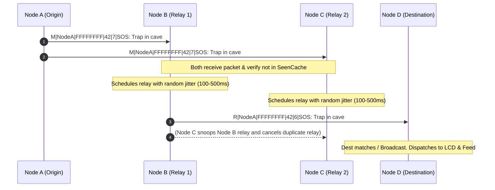
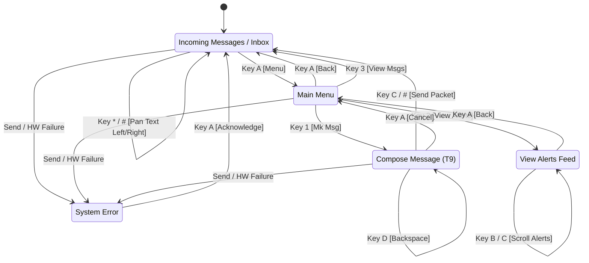

# PipSurvivor 📟⚡
> **Autonomous, Off-Grid Wearable Survival Terminal with Multi-Hop LoRa Mesh & Dead-Man Emergency Detection.**

[](https://www.espressif.com/)
[](https://www.arduino.cc/)
[](https://reyax.com/)
[]()
[](LICENSE)

---

## 🎯 Problem Thesis

### The Fatal Vulnerability of Modern Disaster Communications
During catastrophic events—natural disasters (earthquakes, flash floods, hurricanes, wildfires), wilderness accidents, search-and-rescue (SAR) emergencies, or critical infrastructure collapse—**centralized communications fail almost immediately**. Cell towers lose power or backhaul, 4G/5G networks experience catastrophic congestion or physical destruction, and standard GPS/satellite messengers remain expensive, fragile, closed-source, and power-hungry.

### The Human Incapacitation Blindspot
Traditional survival beacons and radios share a single fatal design flaw: **they require an awake, alert, and physically capable human to manually trigger an SOS signal**. 

In real-world disasters:
- A hiker knocked unconscious by a falling rock or rapid descent into a ravine cannot press an emergency button.
- A driver or worker suffering a high-G vehicle impact or structural collapse is often trapped or immobilized.
- A survivor swept away in a flash flood or rapids will drown within minutes before being able to retrieve or operate a radio.
- Hypothermia, trauma, and disorientation strip away the fine motor skills required to operate standard equipment.

```
┌─────────────────────────────────────────────────────────────────────────────┐
│                          THE SURVIVAL PARADOX                               │
│                                                                             │
│   The exact moment a human's life is in the greatest peril (unconsciousness,│
│   drowning, incapacitating trauma) is the exact moment they are physically  │
│   unable to call for help.                                                  │
└─────────────────────────────────────────────────────────────────────────────┘
```

### The PipSurvivor Solution
**PipSurvivor** is an open-source, ruggedized, wearable personal terminal inspired by post-apocalyptic survival engineering. It resolves the survival paradox through three foundational pillars:

1. **Autonomous "Dead-Man" Multi-Modal Telemetry**: Sensor fusion continuously monitors dynamic physiological and environmental danger vectors (extreme jerk/impact, freefall velocity, structural orientation flip, and prolonged water submersion). If life-threatening conditions occur, PipSurvivor broadcasts high-priority emergency distress packets autonomously.
2. **Infrastructure-Free Multi-Hop LoRa Mesh Networking**: Operating on Sub-GHz LoRa (RYLR998 915MHz) and peer-to-peer ESP-NOW, every PipSurvivor device serves as both an endpoint and an autonomous repeater. Messages dynamically flood through the ad-hoc mesh with TTL decay, collision avoidance, and deduplication—propagating signals across miles through mountains, ruins, and dense canopy without cell towers or internet.
3. **Dual-Tier Resilient User Interface**: A low-overhead physical terminal (2x16 LCD + 4x4 keypad with multi-tap T9 text entry for operation in cold/wet conditions with gloves) combined with an on-demand Wi-Fi SoftAP web portal for local triage and configuration from any smartphone.

---

## ⚡ Key Features

- **Autonomous Multi-Sensor Emergency Engine**:
  - **High-G Impact Detection**: MPU-6050 6-DOF IMU detects severe angular/linear jerk and shockwaves.
  - **Rapid Fall Velocity**: BMP280 precision barometer detects vertical descent velocity and sudden altitude drops.
  - **Incapacitation / Orientation Inversion**: Identifies when a survivor has collapsed flat or inverted.
  - **Submersion & Drowning Protection**: Debounced resistive sensor detects genuine water submersion while filtering surface rain or brief splashing via temporal hysteresis.
- **Self-Healing LoRa Mesh Protocol**:
  - Decentralized flood routing with configurable TTL hop counts (up to 7 hops).
  - Sliding-window packet deduplication cache.
  - Randomized jitter-based relay scheduling to prevent RF packet collisions.
  - Implicit acknowledgment (snooping) to suppress redundant retransmissions.
- **Clean Hexagonal Architecture (Ports & Adapters)**:
  - Complete decoupling between domain business logic, sensor processing, radio communications, and UI drivers.
  - Swappable production adapters (`RYLR998`, `MPU6050`, `BMP280`, `TZT`) and mock adapters (`MockRadio`, `MockDisplay`, `MockAccel`) for unit testing without physical hardware.
- **Dual-Tier Interaction System**:
  - **Field Interface**: 2x16 alphanumeric LCD with 4x4 matrix keypad featuring multi-tap phone-style alphanumeric entry (T9-style typing).
  - **Web Companion**: Embedded Wi-Fi Access Point (`PipSurvivor-Node-XXXX`) serving a responsive touch-optimized virtual terminal, live LCD stream, and real-time mesh routing visualizer (`/mesh`).
- **FreeRTOS Dual-Core Concurrency**:
  - **Core 0**: Dedicated background radio polling, mesh packet forwarding, and non-blocking HTTP web server.
  - **Core 1**: Sensor polling, multi-tap input sampling, state machine transitions, and UI rendering, protected by FreeRTOS mutexes.
- **Wearable 3D-Printable Shell**: Custom top and bottom enclosure models (`top.stl`, `bottom.stl`) designed for wrist-mounted or belt-slung tactical deployment.

---

## 🏗️ System Architecture

PipSurvivor is engineered strictly following **Hexagonal Architecture (Clean Architecture / Ports & Adapters)**. The core application logic does not know or care whether an altitude reading comes from a physical BMP280 over I2C or a synthetic mock test harness.

```mermaid
flowchart TD
    subgraph HW["External Hardware & Sensors"]
        HW_MPU["MPU6050 6-DOF IMU"]
        HW_BMP["BMP280 Barometer"]
        HW_WATER["TZT Water Level Sensor"]
        HW_KEYPAD["4x4 Matrix Keypad"]
        HW_LCD["2x16 LCD Display"]
        HW_LORA["RYLR998 LoRa UART"]
        HW_ESPNOW["ESP-NOW Radio"]
        HW_PHONE["Smartphone Browser"]
    end

    subgraph ADAPTERS["Adapters Layer (Hardware & Virtual)"]
        A_Gyro["Mpu6050GyroscopeAdapter"]
        A_Accel["Mpu6050AccelAdapter"]
        A_Jerk["GyroscopeJerkAdapter"]
        A_Baro["Bmp280BarometerAdapter"]
        A_Alt["BarometerAltitudeAdapter"]
        A_Water["TztWaterLevelAdapter"]
        A_Sub["WaterLevelSubmersionAdapter"]
        A_Alert["AlertDetectionAdapter"]
        A_Keys["MatrixButtonPanelAdapter"]
        A_WebKeys["WebButtonAdapter"]
        A_Disp["MockDisplay / LCD Adapter"]
        A_Radio["Rylr998RadioAdapter / EspNow"]
        A_Web["WebServer API (Core 0)"]
    end

    subgraph PORTS["Ports Layer (Abstract Interfaces)"]
        P_Gyro(["GyroscopePort"])
        P_Accel(["AccelPort"])
        P_Jerk(["JerkPort"])
        P_Baro(["BarometerPort"])
        P_Alt(["AltitudePort"])
        P_Water(["WaterLevelPort"])
        P_Sub(["SubmersionPort"])
        P_Alert(["AlertDetectionPort"])
        P_Keys(["ButtonPanelPort"])
        P_Disp(["DisplayPort"])
        P_Radio(["RadioPort"])
    end

    subgraph CORE_LAYER["Domain Core (MainDevice Application)"]
        CORE["MainDevice State Machine"]
        FEED["Message & Alert Feed Manager"]
        T9["Multi-Tap Text Engine"]
        MESH["Mesh Routing & Deduplication"]
    end

    HW_MPU --> A_Gyro
    HW_MPU --> A_Accel
    HW_BMP --> A_Baro
    HW_WATER --> A_Water
    HW_KEYPAD --> A_Keys
    A_Disp --> HW_LCD
    HW_LORA --> A_Radio
    A_Radio --> HW_LORA
    HW_ESPNOW --> A_Radio
    A_Radio --> HW_ESPNOW
    HW_PHONE --> A_Web
    HW_PHONE --> A_WebKeys

    A_Gyro --> P_Gyro
    A_Accel --> P_Accel
    A_Gyro --> A_Jerk
    A_Jerk --> P_Jerk
    A_Baro --> A_Alt
    A_Alt --> P_Alt
    A_Water --> A_Sub
    A_Sub --> P_Sub

    P_Jerk --> A_Alert
    P_Alt --> A_Alert
    P_Sub --> A_Alert
    P_Accel --> A_Alert
    A_Alert --> P_Alert

    A_Keys --> P_Keys
    A_WebKeys --> P_Keys
    A_Disp --> P_Disp
    A_Radio --> P_Radio

    P_Alert --> CORE
    P_Keys --> CORE
    CORE --> P_Disp
    CORE --> P_Radio
    P_Radio --> CORE

    CORE --- FEED
    CORE --- T9
    CORE --- MESH
```




---

## 📡 Multi-Hop LoRa Mesh Protocol

PipSurvivor uses an ad-hoc flood-routing mesh protocol operating on the 915 MHz band via AT commands over hardware UART (`Serial2`).

### 1. Wire Format
Mesh packets are framed as delimited ASCII strings:
```
<TYPE>|<SENDER_UID>|<DEST_UID>|<MSG_ID>|<TTL>|<PAYLOAD>
```

| Field | Type | Description | Example |
|---|---|---|---|
| `TYPE` | `char` | Packet type: `M` (Message), `R` (Relayed Message), `A` (Emergency Alert), `K` (Directed ACK) | `A` |
| `SENDER_UID` | `HEX (8)` | Unique 32-bit hardware node ID derived from ESP32 MAC address | `E5F60712` |
| `DEST_UID` | `HEX (8)` | Target recipient UID or `FFFFFFFF` for network-wide broadcast | `FFFFFFFF` |
| `MSG_ID` | `uint32` | Monotonically incrementing sequence ID from sender | `104` |
| `TTL` | `uint8` | Remaining Time-To-Live (hop count). Decremented on each relay | `7` |
| `PAYLOAD` | `string` | Data payload (e.g. text message or alert telemetry) | `ALR[main_device] jerk=28.40` |

### 2. Mesh Routing & Collision Mitigation



- **Sliding Deduplication Cache**: Circular buffer of 50 `(sender_uid, msg_id)` hashes prevents infinite echo loops.
- **Randomized Jitter Backoff**: When relaying packets with `TTL > 0`, nodes wait a random duration between 100ms and 500ms before transmitting to avoid RF collisions.
- **Implicit Collision Cancellation**: If a node hears another node transmitting the exact message it has queued in its relay buffer, it cancels its pending relay job.

---

## 🚨 Emergency Detection Engine

The emergency subsystem samples sensors every 250ms and runs telemetry through decoupled validation logic:

| Category | Alert Metric | Trigger Condition | Real-World Scenario |
|---|---|---|---|
| **Physical Shock** | `JerkMagnitude` | Angular/linear jerk $\frac{d\vec{a}}{dt} > 25.0 \text{ m/s}^3$ or angular acceleration threshold | Severe impact, structural collapse, explosion, vehicle collision |
| **Physical Shock** | `FallRapid` | Altitude descent rate $\frac{\Delta h}{\Delta t} > 1.2 \text{ m/s}$ across sliding time window | Freefall, falling from height/cliff, elevator drop |
| **Physical Shock** | `OrientationFlip` | Z-axis gravity ratio $< 0.3$ (loss of upright orientation) | Survivor knocked unconscious, lying flat, trapped |
| **Environmental Danger** | `Submersion` | Normalized moisture $> 0.25$ sustained continuously for $\ge 1200\text{ms}$ | Drowning, flash flood, swept away in river (ignores rain) |

### Anti-False-Positive Filtering
- **Hysteresis & Temporal Debouncing**: Submersion requires a stable high reading over a continuous duration window; splashing or single rain droplets are filtered out.
- **Duplicate Suppression Cache**: Prevents radio spam by caching emitted alert values. Subsequent readings within $\epsilon$ thresholds are suppressed for a cooldown period (default 3000ms–4000ms).

---

## 📟 User Interface & Keypad Flow

### 1. Physical 2x16 LCD State Flow



### 2. Multi-Tap Alphanumeric Keypad Mapping
The 4x4 matrix keypad operates with a multi-tap timeout window (900ms):

| Key | Multi-Tap Characters | Primary Navigation Action |
|:---:|:---|:---|
| **`1`** | `1 . , ! ?` | Menu Selection (1) |
| **`2`** | `2 A B C` | Menu Selection (2) |
| **`3`** | `3 D E F` | Menu Selection (3) |
| **`4`** | `4 G H I` | - |
| **`5`** | `5 J K L` | - |
| **`6`** | `6 M N O` | - |
| **`7`** | `7 P Q R S` | - |
| **`8`** | `8 T U V` | - |
| **`9`** | `9 W X Y Z` | - |
| **`0`** | `0 [Space]` | - |
| **`A`** | - | **MENU / BACK / ACK ERROR** |
| **`B`** | - | **SCROLL UP / COMMIT MULTI-TAP** |
| **`C`** | - | **SCROLL DOWN / SEND MESSAGE** |
| **`D`** | - | **BACKSPACE / DELETE** |
| **`*`** | - | **PAN TEXT LEFT** |
| **`#`** | - | **PAN TEXT RIGHT / ALT SEND** |

---

## 🌐 Web Companion & Diagnostics

PipSurvivor creates an autonomous Wi-Fi Access Point on boot when `kEnableWebServer = true`:
- **SSID**: `PipSurvivor-Node-XXYY` (derived from ESP32 MAC)
- **Password**: `survivor123!`
- **Portal IP**: `http://192.168.4.1/`

### Built-in Endpoints:
- `GET /` — Responsive web app featuring an interactive virtual LCD screen and touch-enabled 4x4 keypad.
- `GET /lcd` — Real-time JSON stream of current 3-line display content: `{"l1":"...","l2":"...","l3":"..."}`.
- `GET /key?k=<KEY_NAME>` — Injects virtual keypad keystrokes (`K0`-`K9`, `A`, `B`, `C`, `D`, `Star`, `Hash`).
- `GET /mesh` — JSON telemetry of recent mesh packets, node UID, TTL status, and packet routing statistics:
```json
{
  "my_uid": "E5F60712",
  "messages": [
    {
      "sender": "A1B2C3D4",
      "msg_id": 46,
      "ttl": 6,
      "payload": "ALR[main_device] submersion=1.00",
      "age_ms": 1420
    }
  ],
  "stats": {
    "total_rx": 28,
    "cache_size": 14,
    "relay_jobs": 0
  }
}
```

---

## 🔌 Hardware Wiring & Pinout

| Module / Function | Signal / Pin | ESP32 GPIO | Notes |
|---|---|---|---|
| **I2C Bus** | SDA | `GPIO 21` | Shared by MPU6050 & BMP280 |
| **I2C Bus** | SCL | `GPIO 22` | Shared by MPU6050 & BMP280 |
| **LoRa UART (RYLR998)** | RXD | `GPIO 16` | Connected to RYLR998 TXD |
| **LoRa UART (RYLR998)** | TXD | `GPIO 17` | Connected to RYLR998 RXD |
| **Water Level Sensor** | Analog SIG | `GPIO 34` | ADC1 input (Input only) |
| **4x4 Keypad Rows** | R1, R2, R3, R4 | `GPIO 32, 33, 25, 26` | Output scan lines |
| **4x4 Keypad Cols** | C1, C2, C3, C4 | `GPIO 27, 14, 12, 13` | Input pullup lines |
| **Power Distribution** | 3.3V / GND | `3V3 / GND` | Sensors powered from regulated rail |

---

## 🛠️ Project Structure

```
PipSurvivor/
├── platformio.ini              # PlatformIO environments & dependency config
├── top.stl                     # 3D printable top shell enclosure
├── bottom.stl                  # 3D printable bottom chassis
├── EMERGENCY_DETECT.md         # Emergency detection specification
├── MESH_HOP_VIS.md             # Mesh networking & visualization design
│
├── src/
│   └── main.cpp                # Core application entrypoint, dual-core tasks, UI loop
│
├── lib/core/src/
│   ├── settings.h              # Global pinout, timing, and feature enable flags
│   │
│   ├── ports/                  # Abstract port interfaces (Hexagonal Core)
│   │   ├── alert_detection_port.h / .cpp
│   │   ├── radio_port.h / .cpp
│   │   ├── display_port.h / .cpp
│   │   ├── button_panel_port.h / .cpp
│   │   ├── accel_port.h / .cpp
│   │   ├── gyroscope_port.h / .cpp
│   │   ├── jerk_port.h / .cpp
│   │   ├── barometer_port.h / .cpp
│   │   ├── altitude_port.h / .cpp
│   │   ├── water_level_port.h / .cpp
│   │   └── submersion_port.h / .cpp
│   │
│   └── adapters/               # Concrete hardware & mock drivers
│       ├── rylr998_radio_adapter.h / .cpp       # LoRa AT-command mesh driver
│       ├── espnow_radio_adapter.h / .cpp        # ESP-NOW peer-to-peer driver
│       ├── mock_radio_adapter.h / .cpp          # Virtual in-memory radio
│       ├── alert_detection_adapter.h / .cpp     # Sensor fusion emergency engine
│       ├── mpu6050_gyroscope_adapter.h / .cpp   # MPU6050 gyro driver
│       ├── mpu6050_accel_adapter.h / .cpp       # MPU6050 accelerometer driver
│       ├── gyroscope_jerk_adapter.h / .cpp      # Numerical jerk derivation
│       ├── bmp280_barometer_adapter.h / .cpp    # BMP280 pressure/temp driver
│       ├── barometer_altitude_adapter.h / .cpp  # Hypsometric altitude calculator
│       ├── tzt_water_level_adapter.h / .cpp     # ADC water level sampler
│       ├── water_level_submersion_adapter.h / .cpp # Temporal submersion filter
│       ├── matrix_button_panel_adapter.h / .cpp # 4x4 matrix keypad scanner
│       └── mock_display_adapter.h / .cpp        # Serial/virtual display driver
│
├── examples/                   # Standalone hardware smoke tests
│   ├── alert_detection_test/   # Sensor fusion alert verification sketch
│   ├── bmp280_altitude_test/   # Barometer altitude & vertical speed test
│   ├── mpu6050_accel_test/     # Accelerometer & shock test
│   ├── mpu6050_gyro_jerk_test/ # Gyroscope angular jerk test
│   ├── tzt_water_level_test/   # Analog water probe calibration test
│   ├── tzt_submersion_test/    # Submersion temporal hysteresis test
│   ├── uart_radio_detect/      # RYLR998 AT-command diagnostic
│   └── sensor_combo_test/      # Multi-sensor integrated smoke test
│
└── flows/user/
    ├── lcd_flow.md             # UI state transition specification
    └── lcd_flow.png            # Visual UI state chart
```

---

## 🚀 Getting Started

### 1. Prerequisites
- [PlatformIO Core (CLI)](https://platformio.org/install/cli) or [PlatformIO for VS Code](https://platformio.org/platformio-ide).
- ESP32 Development Board (e.g. `mhetesp32devkit`, `esp32dev`).

### 2. Configuration (`settings.h`)
Enable or disable physical hardware modules in `lib/core/src/settings.h` based on your connected components:

```cpp
namespace DeviceSettings {
  static constexpr bool kEnableRadio          = true;  // LoRa RYLR998 / ESP-NOW
  static constexpr bool kEnableGyroscope      = true;  // MPU6050 Gyro/Jerk
  static constexpr bool kEnableBarometer      = true;  // BMP280 Altimeter
  static constexpr bool kEnableWaterSensor    = true;  // TZT Water Probe
  static constexpr bool kEnableButtons        = true;  // 4x4 Keypad
  static constexpr bool kEnableDisplay        = false; // Hardware LCD (or Serial mirror)
  static constexpr bool kEnableWebServer      = true;  // Wi-Fi AP + Web UI
}
```

### 3. Build & Flash Main Application
```bash
# Build main firmware
pio run -e node

# Upload to connected ESP32
pio run -e node -t upload

# Open Serial Monitor at 115200 baud
pio device monitor -b 115200
```

### 4. Hardware Unit & Smoke Tests
Run individual standalone tests to verify hardware wiring before running the full system:

```bash
# Smoke test BMP280 Barometer & Altitude
pio run -e test_barometer -t upload

# Smoke test MPU6050 Accelerometer & Impact
pio run -e test_mpu6050_accel -t upload

# Smoke test Water Level & Submersion Hysteresis
pio run -e test_tzt_submersion -t upload

# Smoke test Emergency Alert Detection Fusion
pio run -e test_alert_detection -t upload

# Smoke test Integrated Sensor Combo
pio run -e test_sensor_combo -t upload
```

---

## 🖨️ 3D Printable Enclosure

The root folder includes ready-to-slice STL models for 3D printing a wearable, rugged field enclosure:
- **`top.stl`**: Upper bezel with cutouts for the 2x16 LCD display and 4x4 matrix tactile keypad.
- **`bottom.stl`**: Lower chassis housing the ESP32 devkit, RYLR998 LoRa transceiver, battery, and sensor payload.

**Recommended Print Settings**:
- **Material**: PETG or ABS (recommended for outdoor impact, heat, and moisture resistance).
- **Infill**: 30%–50% Gyroid.
- **Layer Height**: 0.20mm.

---

## 📜 License
This project is open-source under the **MIT License**.
