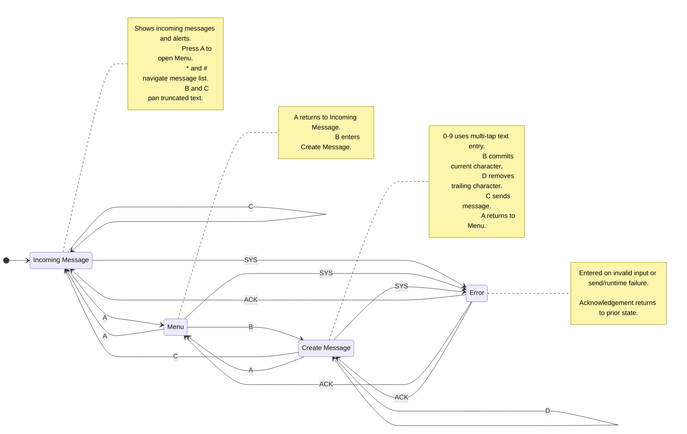

# LCD Message Flow (2x16 LCD)

State transition design for a 2-row x 16-column LCD messaging UI, using a keypad where numeric keys are dedicated to text entry (multi-tap style) and non-numeric keys are used for navigation/actions.

## Keypad Input Mapping

- 0-9: character input (multi-tap phone-style text entry)
- A: menu and back transitions (also error acknowledge)
- B: select/confirm and horizontal text scroll (left)
- C: send action and horizontal text scroll (right)
- D: delete last character in compose state
- *: previous message in incoming message view
- #: next message in incoming message view
